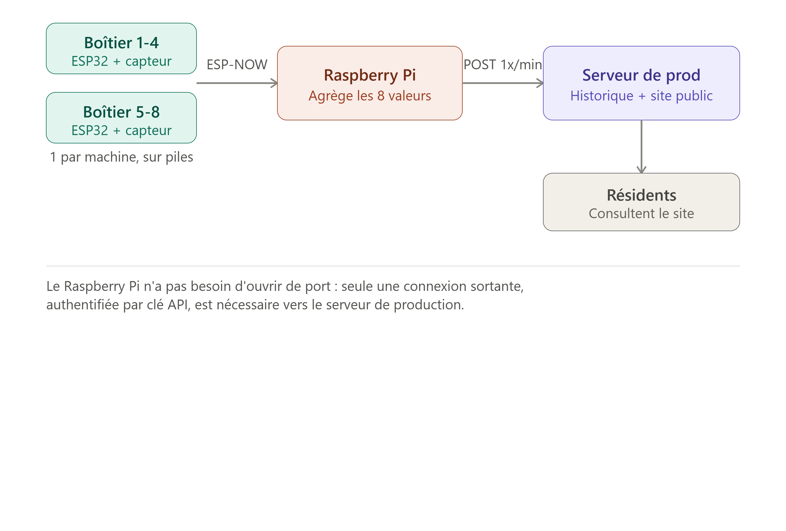

# WashingMachineTracker

Suivi en temps réel de l'état des machines à laver et sèche-linge d'une résidence étudiante, consultable depuis un site web.

## Le projet

Dans une résidence étudiante équipée de 4 machines à laver et 4 sèche-linge communs, il n'existe aujourd'hui aucun moyen de savoir à distance si une machine est libre ou en cours d'utilisation. WashingMachineTracker répond à ce besoin avec un système de capteurs de vibration sans fil couplé à un site web de visualisation.

> **Statut : proof of concept.** Le site de visualisation front-end est fonctionnel (données de test). Le matériel physique (ESP32, capteurs) n'a pas encore été testé.

## Comment ça marche



Chaque boîtier détecte les vibrations de sa machine et transmet la donnée au Raspberry Pi central, qui la relaie au serveur de production. Le site affiche l'état (libre / en cours) de chaque machine ainsi que son historique de vibration.

## Documentation

| Fichier | Contenu |
|---|---|
| [`cahier_des_charges.md`](./cahier_des_charges.md) | Besoin, résumé du projet, exigences fonctionnelles |
| [`hardware.md`](./hardware.md) | Choix matériels (ESP32, capteur, alimentation), liste d'achat, budget |
| [`architecture.md`](./architecture.md) | Flux de données, format du JSON échangé, endpoint API |
| [`frontend.md`](./frontend.md) | Fonctionnement du site de visualisation (POC) |

## Matériel

- **Boîtier machine** : ESP32 + accéléromètre LIS3DH, alimenté par 2 piles AA, communication ESP-NOW
- **Hub central** : Raspberry Pi, agrégation et transmission des données
- Détail complet et budget dans [`hardware.md`](./hardware.md)

## Site de visualisation (POC)

Un premier prototype du site (`washingmachinetracker/`) affiche l'état des 8 machines et un graphique d'historique de vibration, à partir de fichiers JSON de test.

```bash
cd washingmachinetracker
python3 -m http.server 8000
```

Puis ouvrir `http://localhost:8000`. Détails dans [`frontend.md`](./frontend.md).

## Avancement

- [x] Cahier des charges
- [x] Choix de l'architecture matérielle
- [x] POC du site de visualisation (données de test)
- [ ] Firmware ESP32 (lecture accéléromètre, envoi ESP-NOW)
- [ ] Script Python d'agrégation sur le Raspberry Pi
- [ ] Endpoint de réception côté serveur de prod
- [ ] Logique de détection libre / en cours
- [ ] Déploiement sur les 8 machines

## Contexte

Projet mené dans le cadre de l'association réseau de la résidence.
